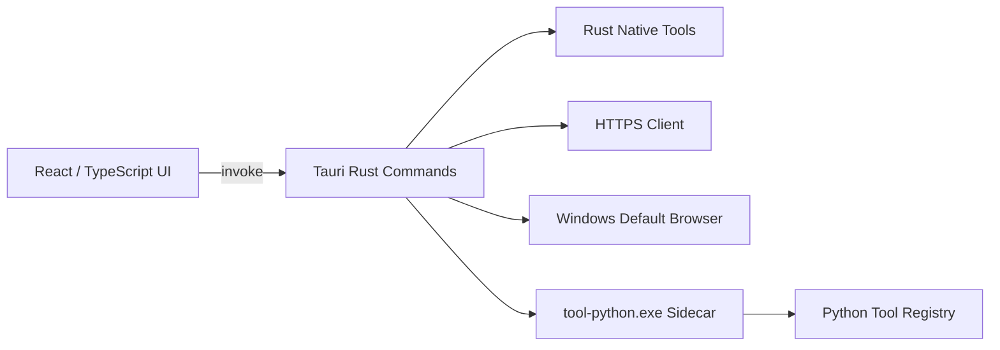

# Windows 工具集合

这是一个面向 **Windows 10/11** 的可扩展本地工具容器，使用 **Tauri 2、Rust、React、TypeScript 与 Python Sidecar** 构建。每个小工具拥有独立页面；功能可以由 Rust 命令、打包后的 Python 工具或 Web 应用实现。应用提供可搜索、可收缩、可滚动的侧边导航，以及适合大量工具的总览网格。

> Windows 发布包会将 Python 工具打包为独立的 `tool-python.exe` Sidecar。最终用户不需要另外安装 Python，也不依赖应用启动时的工作目录。Tauri 的 Sidecar 文件需要采用目标三元组命名，并通过 `externalBin` 随应用打包。[1]

## 当前能力

| 能力 | 实现方式 | 当前状态 |
|---|---|---|
| 工具导航 | 搜索、分类折叠、侧栏收缩、独立滚动 | 已完成 |
| 工具总览 | 响应式卡片网格、运行时标签、占位状态 | 已完成 |
| Python 工具 | PyInstaller Windows Sidecar，由 Rust 白名单调用 | JSON、Base64、UUID 已可用 |
| Rust 工具 | Tauri command | 系统信息、HTTP GET 已可用 |
| Web 工具 | Rust 白名单与 Windows 默认浏览器 | GitHub、Tauri 文档已可用 |
| 网络能力 | Rust `reqwest`，支持 HTTP/HTTPS、超时、重定向和正文限制 | 已完成 |
| Windows 安装包 | NSIS，自动携带 Python Sidecar | 已完成 |
| 自动构建 | GitHub Actions `windows-latest` | 已完成 |

应用仍保留十余个工具占位项。占位项会出现在导航与总览中，但不会被误显示为已实现工具，后续可以逐项替换为真实页面。

## 架构



Windows 发布版不直接执行 `.py` 文件。`scripts/build-python-sidecar.ps1` 会使用 PyInstaller 将 `src-python/tool_runner.py` 构建成 EXE，再由 Tauri 的 Windows 专用配置将其加入安装包。此模式符合 Tauri 官方的 Sidecar 分发方式。[1]

## Windows 开发环境

Tauri 在 Windows 上需要 Microsoft C++ 构建工具与 WebView2；官方 Windows 前置条件文档提供了 Visual Studio Build Tools、Windows SDK 和 WebView2 的安装说明。[2] 本项目使用 Rust 的 MSVC 工具链，并在 GitHub Actions 的真实 Windows Runner 上持续构建。

| 组件 | 建议版本 | 用途 |
|---|---:|---|
| Windows | Windows 10/11 x64 | 开发与运行 |
| Visual Studio Build Tools | 2022 | 安装“使用 C++ 的桌面开发”与 Windows SDK |
| Microsoft Edge WebView2 Runtime | 当前稳定版 | Tauri WebView 运行时 |
| Rust | stable，`x86_64-pc-windows-msvc` | Tauri/Rust 后端 |
| Node.js | 22 | 前端构建 |
| pnpm | 11.12.0 | JavaScript 依赖管理 |
| Python | 3.12 x64 | 仅开发和构建 Python Sidecar 时需要 |

在 PowerShell 中确认环境：

```powershell
node --version
pnpm --version
rustc --version
cargo --version
python --version
```

如果尚未安装 Rust，请通过 [rustup](https://rustup.rs/) 安装，并选择默认的 MSVC 工具链。Windows 端的 Tauri 安装程序可以生成 NSIS 或 MSI；本项目固定生成更便于分发的 NSIS EXE。[3]

## 获取与运行

在 PowerShell 中克隆并安装依赖：

```powershell
git clone https://github.com/Ricord/tauri-local-tool-collection.git
cd tauri-local-tool-collection
corepack enable
corepack prepare pnpm@11.12.0 --activate
pnpm install --frozen-lockfile
```

首次启动开发模式时，命令会自动创建隔离的 Python 虚拟环境、安装 PyInstaller、生成 Windows Sidecar，然后启动 Tauri：

```powershell
pnpm windows:dev
```

从 **v0.2.1** 开始，`pnpm tauri dev`、`pnpm tauri build` 和直接在 `src-tauri` 中运行的 `cargo check/build` 也会自动检查并生成缺失或过期的 Sidecar。推荐继续使用下面的显式命令，以便单独查看 Python 构建输出：

```powershell
pnpm windows:sidecar
```

## 构建 Windows 安装包

一键构建命令会依次检查环境、构建 Python Sidecar、编译前端与 Rust 后端，并生成 NSIS 安装程序：

```powershell
pnpm windows:build
```

成功后，安装程序位于：

```text
src-tauri\target\release\bundle\nsis\*.exe
```

`src-tauri/tauri.windows.conf.json` 只在 Windows 目标下生效，声明 `binaries/tool-python` 为外部二进制，并配置 NSIS 与 WebView2 引导程序。Tauri 支持按平台拆分配置文件，平台配置会与主配置合并。[4]

## GitHub Actions 构建

仓库提供 `docs/windows-build.workflow.yml` 模板。由于当前 GitHub App 凭据没有创建工作流文件所需的 `workflows` 权限，模板不能由本次自动推送直接写入 `.github/workflows/`；Windows 源码、本地构建脚本和文档不受此限制。

如需启用 CI，请在具有工作流写入权限的本地环境中执行：

```powershell
New-Item -ItemType Directory -Force .github\workflows | Out-Null
Copy-Item docs\windows-build.workflow.yml .github\workflows\windows-build.yml
git add .github\workflows\windows-build.yml
git commit -m "ci: enable Windows installer build"
git push
```

启用后，每次推送到 `master` 或 `main`，或创建针对这两个分支的拉取请求时，工作流会在 `windows-latest` 上安装 Node、pnpm、Rust MSVC 与 Python，生成并冒烟测试 Sidecar，检查前端和 Rust 格式，最后构建并上传 NSIS 安装程序。在 GitHub 仓库的 **Actions → Windows Build** 页面也可以手动触发工作流；构建成功后，可在 **Artifacts** 区域下载 `tool-collection-windows-x64`。

## 项目结构

| 路径 | 说明 |
|---|---|
| `src/` | React/TypeScript 前端 |
| `src/components/Sidebar.tsx` | 可搜索、可收缩、可滚动的导航 |
| `src/components/ToolGrid.tsx` | 工具总览网格 |
| `src/components/ToolDetail.tsx` | 当前各工具的独立页面与交互 |
| `src/components/ToolIcon.tsx` | 跨 Windows 字体稳定的 SVG 图标映射 |
| `src-tauri/src/lib.rs` | 工具注册表、Rust 命令、Sidecar 与网络边界 |
| `src-tauri/tauri.conf.json` | 跨平台基础窗口与 CSP 配置 |
| `src-tauri/tauri.windows.conf.json` | Windows Sidecar 与 NSIS 专用配置 |
| `src-tauri/capabilities/default.json` | 主窗口最小 Tauri 权限 |
| `src-python/tool_runner.py` | Python Sidecar 统一入口与工具白名单 |
| `scripts/build-python-sidecar.ps1` | 生成目标三元组命名的 Windows Sidecar |
| `scripts/build-windows.ps1` | Windows 一键安装包构建 |
| `docs/windows-build.workflow.yml` | 可复制到 `.github/workflows/` 的真实 Windows Runner 自动构建模板 |

## 新增 Python 工具

Python 工具统一放入 `src-python/tool_runner.py`。工具处理函数接收字符串参数序列并返回字符串；成功结果写入 UTF-8 标准输出，错误写入标准错误并返回非零退出码。

第一步，添加处理函数并注册到 `TOOLS`：

```python
def text_upper(args: Sequence[str]) -> str:
    if not args:
        raise ToolInputError("请输入文本")
    return args[0].upper()

TOOLS: dict[str, Callable[[Sequence[str]], str]] = {
    "json_formatter": json_formatter,
    "base64_encoder": base64_encoder,
    "uuid_generator": uuid_generator,
    "text_upper": text_upper,
}
```

第二步，在 `src-tauri/src/lib.rs` 的 `PYTHON_TOOLS` 白名单中加入相同 ID，并在 `get_tools()` 中登记工具。`enabled` 应设为 `true`，`runtime` 应设为 `python`。

```rust
const PYTHON_TOOLS: [&str; 4] = [
    "json_formatter",
    "base64_encoder",
    "uuid_generator",
    "text_upper",
];
```

第三步，在 `ToolDetail.tsx` 中为该 ID 添加独立页面或独立组件，并通过 Tauri 调用：

```ts
const result = await invoke<string>("execute_python", {
  scriptName: "text_upper",
  args: [input],
});
```

完成后执行 `pnpm windows:dev`。构建脚本会在 Python 源码变化后自动重建 Sidecar；正式发布前执行 `pnpm windows:build`。

## 新增 Rust 工具

在 `src-tauri/src/lib.rs` 中实现 Tauri command，并把它加入 `tauri::generate_handler!`。然后在 `get_tools()` 注册工具，其中 `runtime` 使用 `rust`，再从对应 React 页面调用命令。

```rust
#[tauri::command]
fn text_length(input: String) -> usize {
    input.chars().count()
}
```

```rust
.invoke_handler(tauri::generate_handler![
    get_tools,
    execute_python,
    get_system_info,
    http_get,
    open_web_tool,
    text_length,
])
```

```ts
const count = await invoke<number>("text_length", { input });
```

对于文件系统、进程或其他高权限功能，应优先在 Rust 命令中限定输入与可访问范围，不要直接向整个前端开放通配权限。

## 新增 Web 工具

Web 工具默认通过 Windows 的默认浏览器打开，而不是把第三方站点嵌入应用 WebView。这可以减少登录兼容性、跨域和第三方脚本带来的问题。

在 `get_tools()` 中将 `runtime` 设置为 `web`，同时填写展示 URL；再把工具 ID 与固定 URL 加入 `WEB_TOOLS` 白名单。前端只传递工具 ID，后端不会接受任意 URL 作为“打开网页”命令。

```rust
const WEB_TOOLS: [(&str, &str); 3] = [
    ("github_web", "https://github.com/"),
    ("tauri_docs_web", "https://v2.tauri.app/"),
    ("my_web_tool", "https://example.com/"),
];
```

如果工具需要调用远程 API，可复用 `http_get`，或新增一个具有明确域名、方法、请求大小和响应大小限制的 Rust command。不要把密钥写入 React 源码或仓库。

## 安全边界

| 边界 | 当前策略 |
|---|---|
| Python 执行 | 工具 ID 白名单；不允许传入脚本路径；参数数量与大小受限 |
| Sidecar 分发 | Windows 安装包携带固定 EXE；最终用户无需 Python |
| Web 打开 | 工具 ID 映射固定 URL；前端不能直接要求打开任意地址 |
| HTTP 请求 | 只允许 HTTP/HTTPS；20 秒超时；最多 5 次重定向；正文限制为 2 MiB |
| Tauri 权限 | 主窗口只授予核心运行权限；高权限操作通过受控 Rust command 暴露 |
| 内容安全策略 | 默认只加载本地应用内容，网络访问由 Rust 后端处理 |

## 常见问题

| 现象 | 处理方式 |
|---|---|
| `link.exe not found` | 安装 Visual Studio Build Tools 2022，并勾选“使用 C++ 的桌面开发”和 Windows SDK，然后重新打开 PowerShell |
| `WebView2` 相关启动错误 | 安装或修复 Microsoft Edge WebView2 Runtime；重新运行 NSIS 安装程序 |
| `resource path binaries\\tool-python-x86_64-pc-windows-msvc.exe doesn't exist` | 更新到 v0.2.1 或更高版本后重新运行原命令，构建流程会自动生成 Sidecar。若仍失败，先执行 `pnpm windows:sidecar` 查看 Python/PyInstaller 的完整错误，再执行 `pnpm windows:dev` |
| PyInstaller 安装失败 | 确认 `python --version` 为可用的 x64 Python，并检查代理与 pip 网络配置 |
| Windows 执行策略拦截脚本 | 项目 npm 命令已使用 `-ExecutionPolicy Bypass` 启动本地构建脚本；也可在已信任的仓库目录中直接运行对应 npm 命令 |
| GitHub Actions 没有安装包 | 打开失败步骤日志；安装包上传步骤要求 `src-tauri/target/release/bundle/nsis/*.exe` 必须存在 |

## 验证命令

在提交代码前，建议依次运行。`cargo check` 会再次执行增量 Sidecar 检查，已有最新 EXE 时不会重新打包：

```powershell
pnpm install --frozen-lockfile
pnpm windows:sidecar
pnpm build
Push-Location src-tauri
cargo fmt --check
cargo check
Pop-Location
pnpm windows:build
```

## 参考资料

[1]: https://v2.tauri.app/develop/sidecar/ "Tauri 2 — Embedding External Binaries"
[2]: https://v2.tauri.app/start/prerequisites/ "Tauri 2 — Prerequisites"
[3]: https://v2.tauri.app/distribute/windows-installer/ "Tauri 2 — Windows Installer"
[4]: https://v2.tauri.app/develop/configuration-files/ "Tauri 2 — Configuration Files"
